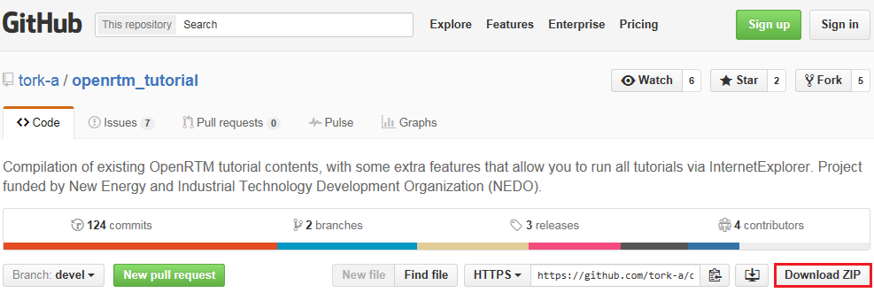
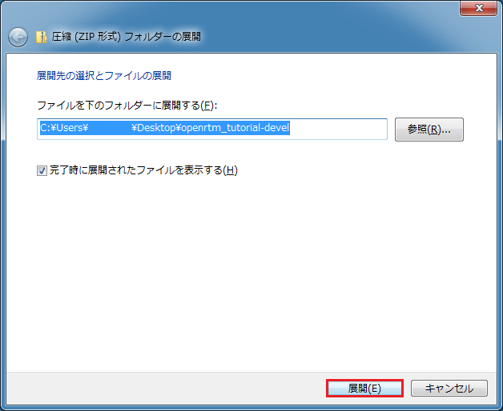
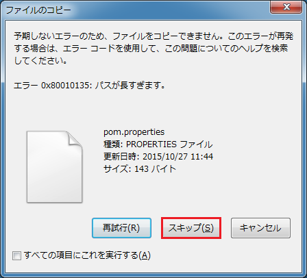
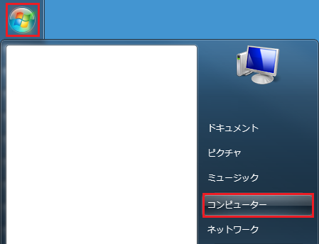
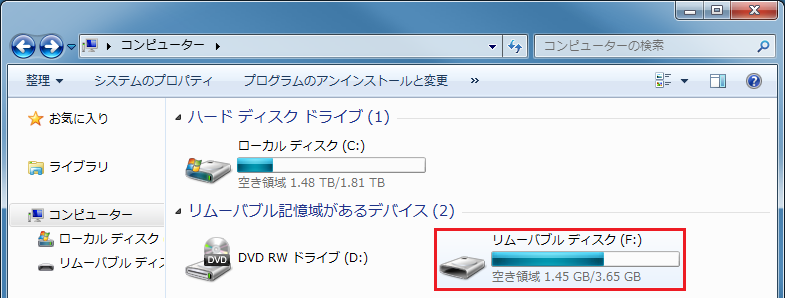
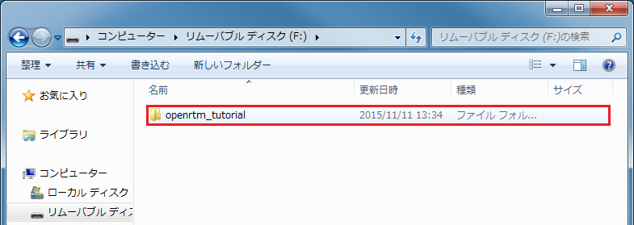
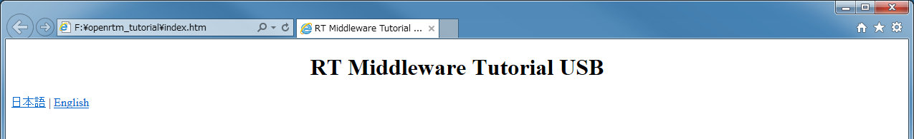
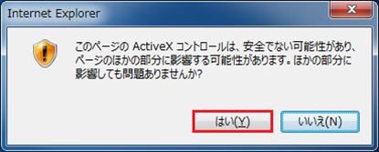

# Start OpenRTM Tutorial

本書では，OpenRTM Tutorialの使い方を説明します．USBメモリにOpenRTM Tutorialを入れるまでと，それ以降に分けて説明します．

[1. はじめに](#section1)  
[2. USBメモリにOpenRTM Tutorial を実装する](#section2)  
[3. USBメモリに実装したOpenRTM Tutorialを利用する](#section3)

## <a name="section1"> 1. はじめに

以下に，OpenRTM Tutorialの動作環境を示します．ご確認ください．

- OS : Windows 7 / 8.1
- ブラウザ : Internet Explorer (IE)

## <a name="section2"> 2. USBメモリにOpenRTM Tutorial を実装する

本項では，USBメモリにOpenRTM Tutorialを実装する手順について解説します．OpenRTM Tutorial入りのUSBメモリを手に入れた方は読み飛ばしていただいて構いません．

1) GitHubの[tork-a/openrtm_tutorial](https://github.com/tork-a/openrtm_tutorial)へアクセスします．

2) 「Download ZIP」をクリックします．1GB近いファイルとなりますので，回線速度によっては相当の時間をダウンロードに要します．

3) ダウンロードしたファイル（openrtm_tutorial-devel.zip）を右クリックし，「すべて展開(T)」をクリックします（Lhaplus等のアーカイバがインストールされている場合は若干手順が異なりますが，最終的なフォルダ名は必ず一致させてください）．

4) 「圧縮（ZIP形式）フォルダーの展開」のウィンドウが開きますので，特に変更を行わず，「展開(E)」をクリックします．なお，2GB近いファイルとなりますので，展開に多少の時間を要します．

5) 展開中に以下に示す警告が表示される場合があります．いずれも「スキップ(S)」を選択してください．

6) 展開後はエクスプローラが開きます．「openrtm_tutorial-devel」というフォルダに展開されたことを確認します．

7)  「openrtm_tutorial-devel」フォルダ内に，「openrt_tutorial-devel」というフォルダが現れますので，クリックした後，右クリックし，「名前の変更(M)」をクリックします．

8) フォルダ名を「openrtm_tutorial」に変更し（「-devel」を削除），「Enter」キーを押して確定します．

9) USBメモリをパソコンに差します．

10) 「スタートボタン」，「コンピューター」の順にクリックします．

11) 該当するリムーバブルディスクに，「openrtm_tutorial」のフォルダをコピーします．

## <a name="section3"> 3. USBメモリに実装したOpenRTM Tutorialを利用する

本項では，USBメモリに実装したOpenRTM Tutorialを利用する手順について解説します．途中，いくつかの制約条件が発生しますのでご注意ください．

1) USBメモリをパソコンに差します．

2) 「スタートボタン」，「コンピューター」の順にクリックします．

3) 「リムーバブル ディスク (F:)」を開きます（ダブルクリックします）．なお，現在のところ（2015年12月11日），OpenRTM Tutorialを利用するためには，USBメモリのドライブ名が「F」である必要があります．ドライブ名変更手順については，[こちら](02_Change_DriveName.md)を参照してください．

4) 「openrtm_tutorial」のフォルダを開きます（ダブルクリックします）．

5) 「index.htm」を右クリックし，「プログラムから開く」を選択し，「Internet Explorer」をクリックします．

6) 言語選択画面が現れますので，「日本語」，「English」のいずれかをクリックします．以下は「日本語」を選択した場合を例に説明します．

7) デモ選択画面が現れますので，体験したいデモを選択します．なお，ブラウザ下方に，「このWebページはスクリプトやActiveXコントロールを実行しないように制限されています。」と表示されますので，「ブロックされているコンテンツを許可(A)」をクリックします．

8) チュートリアルに従って，デモを進めてください．なお，チュートリアル実行中に以下に示す2つの警告が出ますが，いずれも承諾してください（ActiveXに関する警告，およびファイアウォールに関する警告）．

