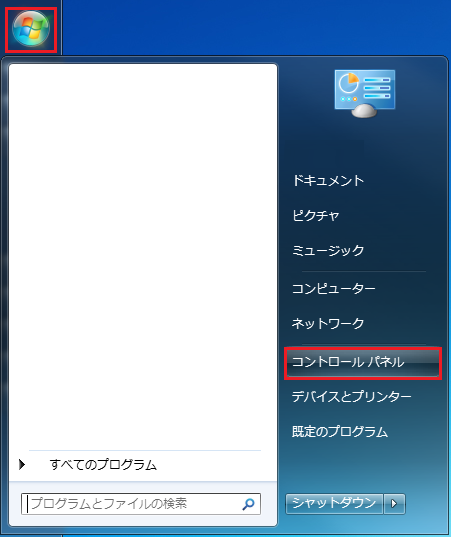
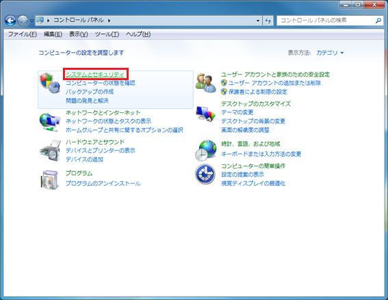
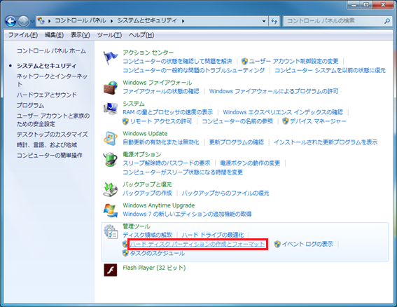
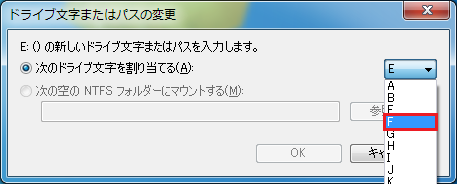

# ドライブ名変更手順

OpenRTM Tutorial は現在（2015年11月30日）のところ，ドライブ名が「F:」以外に非対応という仕様になっています．本文書では，OpenRTM Tutorial を搭載したUSB メモリのドライブ名を「F:」に変更する手順について解説します．

1) USBメモリ（リムーバブル ディスク）のドライブ名が「F:」以外であることを確認します（本書では，「E:」が割り当てられている場合を例に説明します）．

2) 「スタートボタン」，「コントロールパネル」の順に選択します．

3) 「システムとセキュリティ」を選択します．

4) 「ハードディスク パーティションの作成とフォーマット」を選択します．

5) USBメモリのドライブ名を選択します（本書では，「E:」を選択しています）．

6) USBメモリのドライブ名を右クリックし，「ドライブ文字とパスの変更」を選択します（本書では，「E:」を選択しています．

7) 「変更」を選択します．

8) ドロップダウンリストで「F」を選択します．

9) 「OK」を選択します．

10) 「はい(Y)」を選択します．

